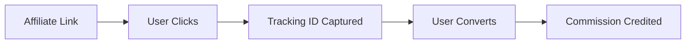

<Info>
This comprehensive guide walks through all the steps an **operator** (program owner / admin) must take to create, configure, and run an affiliate program in Affelios. Follow this step-by-step process to get your program up and running successfully.
</Info>

## 1. Choosing a Plan

Choose a plan based on your anticipated volume and business needs.

<Tabs>
  <Tab title="Flex">
    <Card title="Flex Plan" icon="zap">
      **Monthly Fee:** $0 (pay-as-you-go)
      
      **Best for:** New or low-volume users
      
      **Volume Limits:**
      - Under ~80k clicks per month
      - Under 4,000 transactions per month
      
      **Features:**
      - Pay only for what you use
      - Full platform access
      - Basic reporting
    </Card>
  </Tab>
  <Tab title="Pro">
    <Card title="Pro Plan" icon="star">
      **Monthly Fee:** $399 + usage fees
      
      **Best for:** Mid-level usage
      
      **Volume Limits:**
      - ~80k–160k clicks per month
      - 4k–8k transactions per month
      
      **Features:**
      - All Flex features
      - Advanced reporting
      - Priority support
      - Custom integrations
    </Card>
  </Tab>
  <Tab title="Enterprise">
    <Card title="Enterprise Plan" icon="crown">
      **Monthly Fee:** $799 + usage fees
      
      **Best for:** High-volume usage
      
      **Volume Limits:**
      - 160k+ clicks per month
      - 8k+ transactions per month
      - For very high volume (>1M), contact support
      
      **Features:**
      - All Pro features
      - Dedicated account manager
      - Custom solutions
      - SLA guarantees
    </Card>
  </Tab>
</Tabs>

<Tip>
If you're uncertain about your volume needs, start with the **Flex** plan and upgrade as your program grows. You can change plans at any time.
</Tip>  

---

## 2. Creating an Affelios Subscription

<Warning>
The subscription setup process may vary slightly depending on your current UI. The following steps represent the typical flow for creating an Affelios subscription.
</Warning>

<Steps>
  <Step title="Sign In or Create Account">
    Sign in to your existing **Affelios Identity** account or create a new one if you're a new user.
  </Step>
  <Step title="Select Your Plan">
    Choose your desired plan (Flex, Pro, or Enterprise) based on your volume requirements from the previous section.
  </Step>
  <Step title="Provide Business Details">
    Enter your billing information and business details required for account setup.
  </Step>
  <Step title="Confirm and Activate">
    Review your subscription details and confirm to activate your account.
  </Step>
</Steps>

<Info>
Once your subscription is active, you'll have full access to the Affelios platform and can proceed to configure your affiliate program.
</Info>

---

## 3. Configuring Your Program

This is the foundational setup for your affiliate program. These settings will define how your program operates and how affiliates interact with your system.

<Card title="Program Configuration Overview" icon="settings">
The program configuration includes essential settings for branding, communication, payments, and tracking that will apply to your entire affiliate program.
</Card>

### 3.1 Program Settings & Branding

Navigate to **Program / Settings** to configure your core program settings:

<AccordionGroup>
  <Accordion title="Email Configuration">
    Configure email addresses for different types of communications:
    
    - **Admin Email From**: Email used for admin notifications
    - **Accounts Email From**: Email used for affiliate/account notifications  
    - **Administrator Email**: For general administrative queries
    - **Accounts Email**: For account-specific communications
  </Accordion>
  
  <Accordion title="Legal & Compliance">
    Set up required legal documents and compliance settings:
    
    - **Terms URL**: Link to your affiliate terms & conditions
    - **Privacy Policy URL**: Link to your privacy policy
    - **Base Currency**: Currency for all commissions, payouts, and accounting
  </Accordion>
  
  <Accordion title="Affiliate Management">
    Configure how affiliates are managed and approved:
    
    - **Auto-Approve Affiliates**: Toggle to allow automatic affiliate approval
    - **Clean Slate / No Negative Carry-Over**: Reset affiliate balances each period
    - **Organic Tracking**: Enable default attribution for untagged conversions
  </Accordion>
</AccordionGroup>  

### 3.2 Affiliate Payout Options

<Card title="Payment Configuration" icon="credit-card">
Configure the payment methods and tax settings that affiliates can use to receive their commissions.
</Card>

Still within program settings, enable payout methods you support:

- Bank transfer
- PayPal
- Cryptocurrency
- Other payment processors

Affiliates will select from these available methods when registering.

<Tip>
Also configure any relevant tax settings (e.g. withholding, VAT, etc.) based on your business location and legal requirements.
</Tip>

### 3.3 Custom Domain Setup (Optional but Recommended)

<Warning>
While optional, using a custom domain significantly improves your program's professional appearance and brand consistency.
</Warning>

<Steps>
  <Step title="Add Custom Domain">
    Click **Add Custom Domain** in your program settings.
  </Step>
  <Step title="Enter Hostname">
    Enter the hostname you wish to use (e.g., `affiliates.yourcompany.com`).
  </Step>
  <Step title="Configure DNS Records">
    Add the required DNS records to your domain registrar as provided by Affelios.
  </Step>
  <Step title="Validate Configuration">
    After DNS propagation (which may take time), validate the records via the "Validate" button.
  </Step>
  <Step title="Complete Setup">
    Mark the domain-setup step as complete once validation is successful.
  </Step>
</Steps>

<Info>
DNS propagation can take anywhere from a few minutes to 48 hours depending on your domain provider and geographic location.
</Info>  

### 3.4 Commission Plan Defaults & Brand Association

<Card title="Commission Planning" icon="percent">
Set up default commission plans that will apply broadly across your program, with the ability to create more specific plans later.
</Card>

- During setup or in later configuration, create **default commission plans** that apply broadly.
- When creating a **Brand**, you may designate a default commission plan that will apply to all products under that brand (unless overridden).

### 3.5 Internal Affiliate (Optional)

<Info>
Creating an internal affiliate account allows you to track in-house campaigns and internal marketing efforts through the same system your external affiliates use.
</Info>

You can create an internal affiliate account during setup to track your own marketing campaigns.

### 3.6 Tracker / Traffic Source Setup

<Card title="Tracking Configuration" icon="target">
Set up default tracking mechanisms and allow affiliates to create their own traffic sources for better campaign organization.
</Card>

Configure tracking options:

- Create a **default tracker** to attribute conversions when no other tracker is provided
- Allow affiliates to add traffic sources (e.g. their website, social media)
- Optionally verify sources by DNS record or meta tag
- Create trackers with descriptive names (e.g. "HomepagePromo")

### 3.7 Completing Setup

<Steps>
  <Step title="Review Configuration">
    Double-check all your program settings, payment methods, and tracking configuration.
  </Step>
  <Step title="Complete Setup">
    When all required steps are done, click **Complete Setup**.
  </Step>
  <Step title="Program Ready">
    Your program is now ready for use and affiliate onboarding!
  </Step>
</Steps>  

---

## 4. Brands, Products & Media

<Card title="Brand & Product Management" icon="tag">
Once your program is configured, you'll need to create brands and products that affiliates can promote. This section covers setting up your catalog and tracking parameters.
</Card>

### 4.1 Create & Configure a Brand

Navigate to the **Brands** section to create your first brand. When adding a brand, you'll need to provide:

<AccordionGroup>
  <Accordion title="Basic Information">
    - **Name**: Your brand's display name
    - **Industry**: The industry category your brand operates in
    - **External ID**: Your internal identifier for syncing with external systems
  </Accordion>
  
  <Accordion title="Landing Page & Tracking">
    - **Landing Page URL**: Include the tracking parameter (ClickKey placeholder)
    
    <CodeGroup>
      <CodeGroupItem title="Example URLs" active>
        ```bash
        https://yourdomain.com/?clickId=[ClickKey]
        https://yourdomain.com/?referral=[ClickKey]
        https://yourdomain.com/product?utm_source=affiliate&clickId=[ClickKey]
        ```
      </CodeGroupItem>
    </CodeGroup>
    
    The parameter name must match how you set up tracking in your system.
  </Accordion>
  
  <Accordion title="Integration Options">
    Choose your preferred integration method:
    
    - REST API
    - JavaScript SDK
    - Webhook integration
    - Custom integration
  </Accordion>
</AccordionGroup>

### 4.2 ClickKey & Tracking Parameter

<Info>
The **ClickKey** is the query parameter name you use to pass tracking IDs. This is how Affelios identifies which affiliate should receive credit for a conversion.
</Info>

<Card title="Common ClickKey Examples" icon="link">
<CodeGroup>
  <CodeGroupItem title="clickId" active>
    ```bash
    https://example.com/product?clickId=abc123
    ```
  </CodeGroupItem>
  <CodeGroupItem title="gclid">
    ```bash
    https://example.com/product?gclid=abc123
    ```
  </CodeGroupItem>
  <CodeGroupItem title="btag">
    ```bash
    https://example.com/product?btag=abc123
    ```
  </CodeGroupItem>
</CodeGroup>
</Card>

When creating a brand, you specify the parameter placeholder (e.g. `[ClickKey]`) in your landing URL. Affelios will replace this with the actual tracking ID during use.  

### 4.3 Commission Plans & Selection Logic

<Card title="Commission Plan Hierarchy" icon="layers">
Affelios uses a sophisticated cascading system to determine which commission plan applies to each transaction, always choosing the most specific applicable plan.
</Card>

#### How Commission Plans Are Selected

<Info>
The system evaluates commission plans in order of specificity, starting with the most detailed combination and falling back to more general plans if no specific match is found.
</Info>

<AccordionGroup>
  <Accordion title="Affiliate-Specific Plans (Highest Priority)">
    Affelios first looks for plans specific to the individual affiliate:
    
    1. **Affiliate + Brand + Product + Tracker** (Most specific)
    2. **Affiliate + Brand + Tracker**
    3. **Affiliate + Tracker**
    4. **Affiliate + Product**
    5. **Affiliate + Brand**
    6. **Affiliate only** (Least specific affiliate plan)
  </Accordion>
  
  <Accordion title="Default Plans (Fallback)">
    If no affiliate-specific plan matches, the system falls back to default plans:
    
    1. **Default Product Plan** (Brand + Product)
    2. **Default Brand Plan**
    3. **Fully Default Plan** (System-wide default)
  </Accordion>
</AccordionGroup>

<Tip>
You can create commission rules at multiple scopes. The system always prefers the more specific plan over generic ones, giving you flexibility to create custom rates for specific affiliates or campaigns while maintaining sensible defaults.
</Tip>  

  
### 4.4 Uploading Media for Affiliates

<Card title="Marketing Assets" icon="image">
Providing high-quality marketing assets helps affiliates promote your brand more effectively and maintains brand consistency across all promotional materials.
</Card>

<Steps>
  <Step title="Navigate to Media Section">
    Go to **Media → Upload Media** in your dashboard.
  </Step>
  <Step title="Upload Assets">
    Upload your marketing materials:
    - Images and banners
    - HTML5 ZIP packages following IAB guidelines
    - Logo variations
    - Product photos
  </Step>
  <Step title="Configure Landing Pages (Optional)">
    Assign custom landing pages per media asset so you can change redirect URLs without requiring affiliates to update their links.
  </Step>
  <Step title="Publish to Affiliate Portal">
    Affiliates will see these assets in their portal and can use them in their campaigns.
  </Step>
</Steps>

<Tip>
Following IAB (Interactive Advertising Bureau) guidelines ensures your creative assets meet industry standards and work well across different advertising platforms.
</Tip>

### 4.5 Create & Configure Products

<Card title="Product Setup" icon="package">
Create products that affiliates can promote. Each product should be associated with a brand and can have its own commission rates and tracking settings.
</Card>

<Warning>
Product configuration details may vary based on your specific setup. The following represents the typical product creation flow.
</Warning>

When creating a product, you'll typically need to provide:

<AccordionGroup>
  <Accordion title="Basic Product Information">
    - **Product Name**: Display name for the product
    - **External ID**: Your internal identifier for syncing
    - **Description**: Product description for affiliates
    - **Category**: Product category or type
  </Accordion>
  
  <Accordion title="Pricing & Commission">
    - **Price**: Product price for commission calculations
    - **Commission Rate**: Default commission percentage or amount
    - **Brand Association**: Link to the appropriate brand
  </Accordion>
  
  <Accordion title="Tracking & Links">
    - **Product URL**: Direct link to the product page
    - **Tracking Parameters**: ClickKey configuration
    - **Custom Landing Page**: Optional custom redirect URL
  </Accordion>
</AccordionGroup>

---

## 5. Tracking & Links

<Card title="Tracking & Link Management" icon="link-2">
Learn how to create and manage tracking links that allow affiliates to promote your products while ensuring proper attribution and commission tracking.
</Card>

### 5.1 How Tracking Works

<Info>
A **tracking link** is a URL that carries a unique identifier (via your ClickKey parameter) so that when users click and convert, the system knows which affiliate must be credited for the sale.
</Info>

<Card title="Tracking Flow" icon="arrow-right">

</Card>

Affiliates can create multiple trackers to segment campaigns or traffic sources, giving you detailed insights into which promotional efforts are most effective.

### 5.2 Creating a Tracker & Traffic Source

<Steps>
  <Step title="Navigate to Trackers">
    Go to **Trackers** in the left navigation menu.
  </Step>
  <Step title="Add Traffic Source (Optional)">
    First, add or manage a **Traffic Source**:
    - Enter the source URL (e.g., affiliate's website, social channel)
    - Optionally verify via DNS record or meta tag for additional security
  </Step>
  <Step title="Create Tracker">
    Create a **Tracker** with a descriptive label (e.g., "Email Campaign", "Social Media", "Website Banner").
  </Step>
  <Step title="Generate Link">
    Once saved, use the "Get Link" action to copy a properly parameterized tracking link.
  </Step>
  <Step title="Reuse Tracker">
    You can reuse that tracker for future links to maintain consistent tracking across campaigns.
  </Step>
</Steps>

### 5.3 Generating Tracking Links

<Card title="Link Generation Process" icon="external-link">
Once your tracker exists, generating tracking links is straightforward.
</Card>

<AccordionGroup>
  <Accordion title="Get Tracking Link">
    - Use the "Get Link" action next to your tracker to view the full URL
    - The link includes your ClickKey parameter with the actual tracking value
    - Copy and share with affiliates for embedding in promotions
  </Accordion>
  
  <Accordion title="Attribution Process">
    - Each time the link is clicked and a conversion occurs
    - Affelios attributes the conversion to the correct affiliate/tracker
    - Commission is calculated based on the plan hierarchy described in section 4.3
  </Accordion>
</AccordionGroup>  

### 5.4 PPC / Google Tag Manager Integration (Parallel Tracking)

<Card title="Advanced Tracking Integration" icon="zap">
For PPC campaigns, parallel tracking ensures that clicks from paid advertising correctly pass through tracking parameters for proper attribution, even when users don't click through affiliate links.
</Card>

<Info>
Parallel tracking is essential for PPC campaigns because it allows you to attribute conversions to the correct affiliate even when users interact with your paid ads directly.
</Info>

<Steps>
  <Step title="Enable Parallel Tracking">
    In **Brands → Edit**, enable **parallel tracking** for the brand you want to track.
  </Step>
  <Step title="Copy Code Snippet">
    Copy the provided JavaScript code snippet from the Affelios dashboard.
  </Step>
  <Step title="Configure Google Tag Manager">
    In Google Tag Manager:
    - Create a **Custom HTML tag**
    - Paste the Affelios code snippet
    - Set trigger to **All Pages** (or your preferred trigger)
    - Save and publish the container
  </Step>
  <Step title="Configure Tracker Templates">
    Configure your tracker(s) to use the **parallel tracking** template:
    - By default, Affelios provides a Google template
    - You can also set custom templates if needed
  </Step>
</Steps>

<CodeGroup>
  <CodeGroupItem title="Example GTM Configuration" active>
    ```html
    <!-- Affelios Parallel Tracking Code -->
    <script>
    // Your tracking code snippet from Affelios
    </script>
    ```
  </CodeGroupItem>
</CodeGroup>

<Tip>
With parallel tracking enabled, clicks from PPC campaigns will correctly pass through tracking parameters for attribution, ensuring affiliates receive proper credit for their promotional efforts.
</Tip>

---

## 6. User Permissions & Roles

<Card title="Team Management" icon="users">
Manage your team by inviting users and assigning appropriate roles and permissions to help manage your affiliate program.
</Card>

<Warning>
User permission configurations may vary based on your specific setup. The following represents typical role management functionality.
</Warning>

<AccordionGroup>
  <Accordion title="Inviting Team Members">
    As an operator, you can **invite users** (e.g. team members) to help manage the program:
    - Send invitations via email
    - Set initial role assignments
    - Manage pending invitations
  </Accordion>
  
  <Accordion title="Role Management">
    Assign granular roles and permissions:
    - **Read-only**: View-only access to reports and data
    - **Media Manager**: Upload and manage marketing assets
    - **Payout Manager**: Process affiliate payments
    - **Affiliate Manager**: Approve and manage affiliates
    - **Full Admin**: Complete program access
  </Accordion>
  
  <Accordion title="Security Best Practices">
    - Ensure each user only has access to functions they require
    - Regularly review and update user permissions
    - Remove access for team members who no longer need it
  </Accordion>
</AccordionGroup>

---

## 7. Data, Reporting & API

<Card title="Data & Analytics" icon="bar-chart">
Access comprehensive reporting and programmatic access to your affiliate program data for analysis and automation.
</Card>

### 7.1 Exporting & Reporting

<Card title="Reporting Dashboard" icon="pie-chart">
Access detailed analytics and reporting through the Affelios dashboard.
</Card>

You can view and export comprehensive data including:

- **Click Analytics**: Track link performance and user engagement
- **Conversion Data**: Monitor sales and conversion rates
- **Affiliate Performance**: Individual and aggregate affiliate statistics
- **Commission Reports**: Detailed payout and earnings data
- **Custom Reports**: Create tailored reports for specific needs

### 7.2 API & Programmatic Access

<Card title="API Integration" icon="code">
Integrate Affelios with your existing systems and automate common tasks using our REST API.
</Card>

<AccordionGroup>
  <Accordion title="API Key Management">
    Generate and manage **API keys** to access program data programmatically:
    - Create new API keys
    - Set permissions and access levels
    - Monitor API usage and limits
  </Accordion>
  
  <Accordion title="Common Use Cases">
    Use the API for:
    - Automating affiliate management
    - Syncing data with external systems
    - Custom reporting and analytics
    - Integration with CRM systems
    - Automated payout processing
  </Accordion>
</AccordionGroup>

---

## 8. Billing, Subscription & Cancellation

<Card title="Billing Management" icon="credit-card">
Monitor your usage, manage your subscription, and handle billing-related tasks.
</Card>

### 8.1 Understanding Billing Cycles & Usage

<Card title="Usage Monitoring" icon="activity">
Keep track of your usage to stay within your plan limits and optimize costs.
</Card>

<AccordionGroup>
  <Accordion title="Usage Tracking">
    Review your current usage:
    - **Clicks**: Number of clicks processed
    - **Transactions**: Number of conversions tracked
    - **API Calls**: Programmatic access usage
    - **Storage**: Media and data storage usage
  </Accordion>
  
  <Accordion title="Billing Cycles">
    Monitor your billing cycle:
    - Current billing period
    - Next billing date
    - Usage against plan limits
    - Projected costs
  </Accordion>
</AccordionGroup>

### 8.2 Canceling a Subscription

<Warning>
Before canceling your subscription, ensure you've exported any important data and notified your affiliates of the change.
</Warning>

<Steps>
  <Step title="Navigate to Billing">
    Go to the subscription / billing area in your dashboard.
  </Step>
  <Step title="Cancel Subscription">
    Choose **Cancel Subscription** and follow the prompts.
  </Step>
  <Step title="Contact Support (If Needed)">
    If you need help with account termination or have questions, contact support.
  </Step>
  <Step title="Review Charges">
    Be aware of any prorated or outstanding charges that may apply.
  </Step>
</Steps>  

---

## Best Practices & Tips

<Card title="Optimization Tips" icon="lightbulb">
Follow these best practices to ensure your affiliate program runs smoothly and efficiently.
</Card>

<AccordionGroup>
  <Accordion title="Start Simple">
    **Begin with basics, then expand:**
    - Initially configure minimal defaults
    - Layer in more granular commission rules as you grow
    - Don't overcomplicate your initial setup
  </Accordion>
  
  <Accordion title="Naming Conventions">
    **Use consistent naming:**
    - Brands, trackers, and media should map to your internal systems
    - Use descriptive names that make sense to your team
    - Avoid generic names like "Campaign 1" or "Test Brand"
  </Accordion>
  
  <Accordion title="Tracking Verification">
    **Always verify your tracking:**
    - Test links and confirm click attribution works
    - Verify commission calculations are correct
    - Check that conversions are being recorded properly
  </Accordion>
  
  <Accordion title="Asset Management">
    **Maintain organized assets:**
    - Keep version control of media assets
    - Update campaign templates regularly
    - Maintain consistent affiliate messaging
  </Accordion>
  
  <Accordion title="Regular Audits">
    **Periodically review your setup:**
    - Audit commission plan overlaps
    - Check for unintended fallbacks
    - Review affiliate performance and adjust plans
  </Accordion>
</AccordionGroup>

---

<Card title="Next Steps" icon="arrow-right">
<Info>
For additional information about specific features like product configuration or user permissions, refer to the dedicated articles in the knowledge base or contact support for assistance.
</Info>

**What's Next?**
- [Affiliate Onboarding](/knowledge-base/getting-started/for-affiliates) - Guide for your new affiliates
- [Commission Plans](/knowledge-base/platform/commission-plans) - Detailed commission configuration
- [Reporting](/knowledge-base/reporting/reports) - Advanced reporting features
- [API Documentation](/developers/reference/overview) - Programmatic access guide
</Card>
